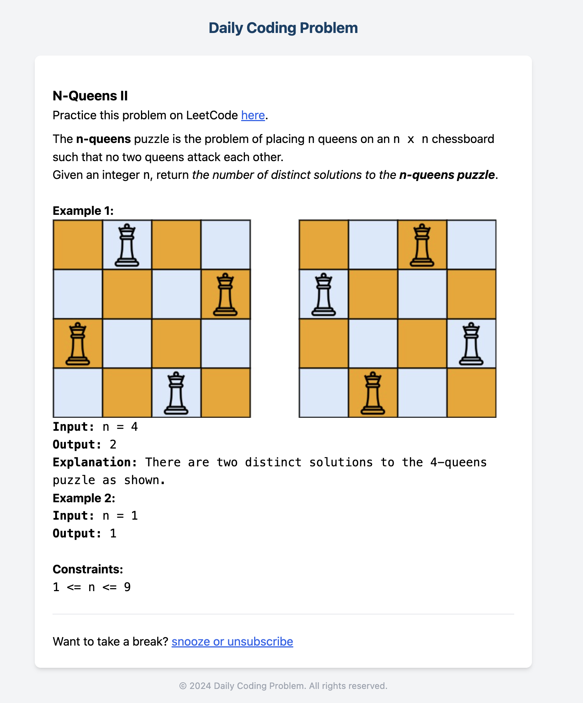

# Email Generation Service




An application that provides an API service for generating HTML email templates. The service is built using Express.js and React, with Tailwind CSS for styling. It allows clients to submit problem descriptions, and the service will generate a complete HTML email using React components.

## Table of Contents

- [Project Overview](#project-overview)
- [Features](#features)
- [Installation](#installation)
- [Usage](#usage)
- [Running Tests](#running-tests)
	- [Test the GitHub Actions via _Docker_](#test-the-github-actions-via-_docker_)
- [API Documentation](#api-documentation)
- [License](#license)

## Project Overview

This project is a back-end service built with Express.js and React, using Tailwind CSS for styling. It is designed to generate HTML emails based on input data provided by clients. The service can be used as a standalone microservice or integrated into larger systems that require email generation functionality.

## Features

- **API for Email Generation**
	- Submit problem data and generate styled HTML emails.
	- Optional solution content in emails.
- **React-based Email Templates**
	- Modularized components for easy customization.
	- Tailwind CSS for consistent and responsive styling.

## Installation

Clone the repository.

```bash
git clone https://github.com/daily-coding-problem/email-service.git
cd email-service
```

Install the dependencies.

```bash
pnpm install
```

## Usage

Start the development server.

```bash
pnpm start
```

Open [http://localhost:3000](http://localhost:3000) to access the service.

### Docker

Build the Docker image.

```bash
docker compose build
```

Run the Docker container.

```bash
docker compose up
```

## Running Tests

Run the tests with the following command:

```sh
npm test
```

### Test the GitHub Actions via _Docker_

To test the GitHub Actions via _Docker_, execute the following:

```sh
docker compose down -v && docker compose up --build github-action-jest-tests
```

## API Documentation

The API is documented using Swagger. After starting the server, you can access the API documentation at:

```
http://localhost:3000/api-docs
```

## License

This project is licensed under the MIT License - see the [LICENSE](LICENSE) file for details.
